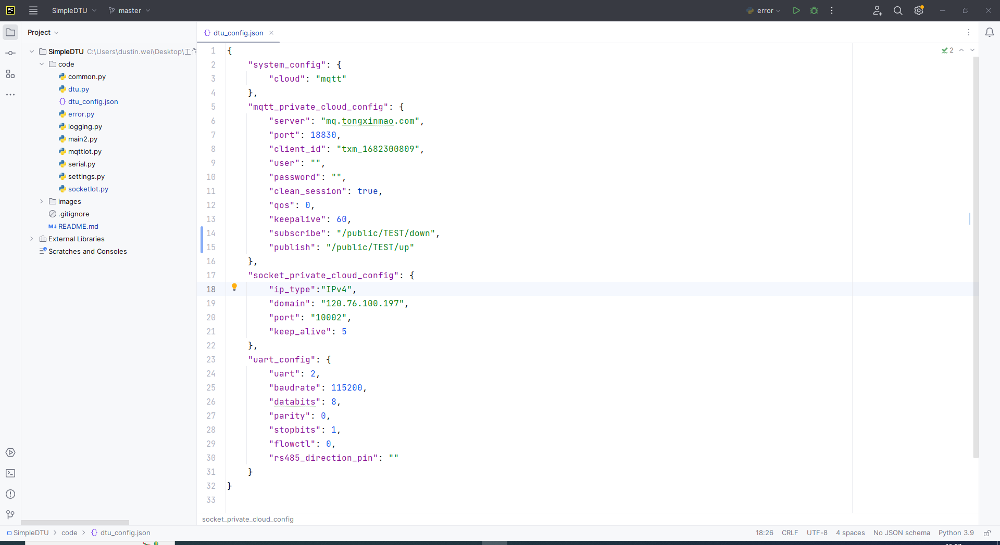
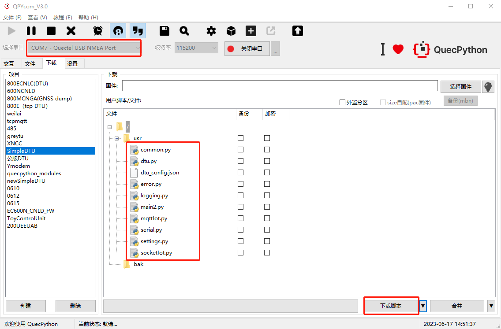
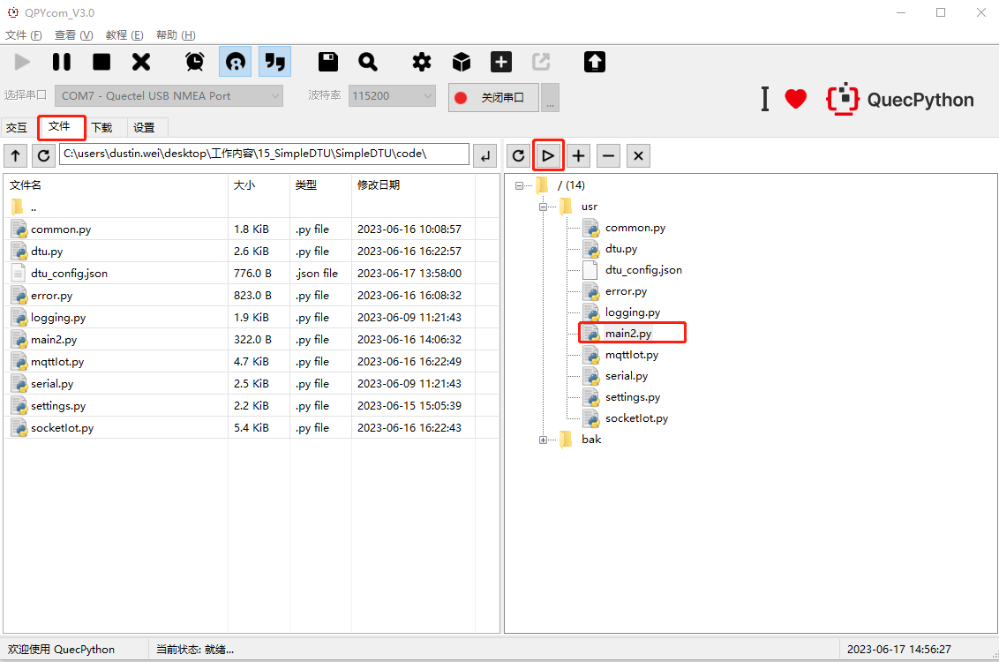
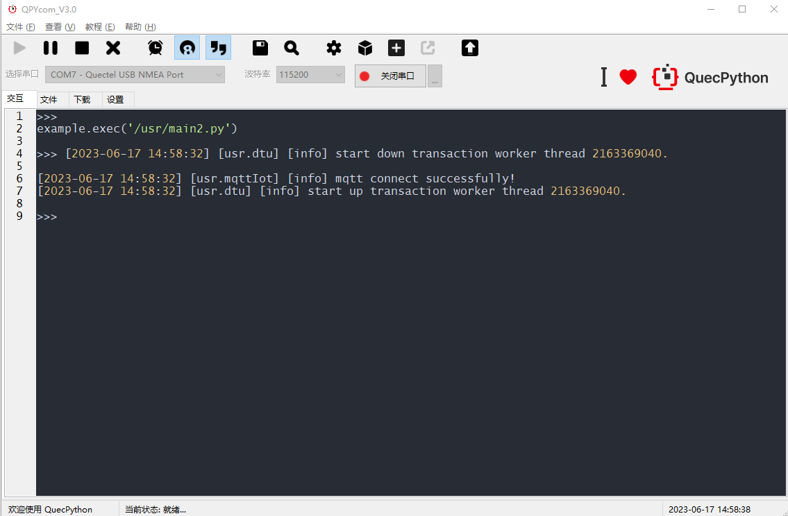
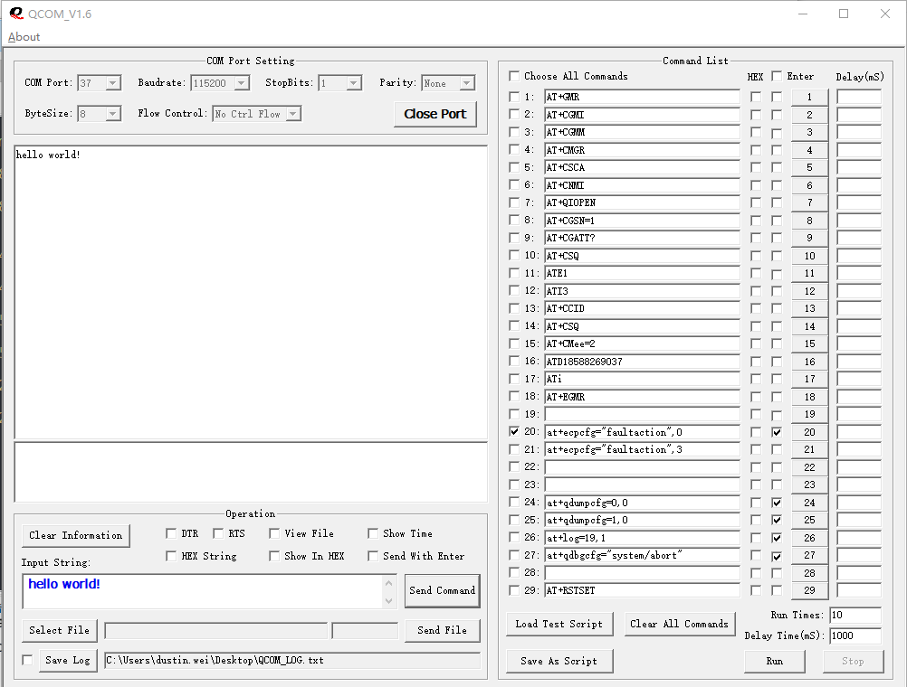
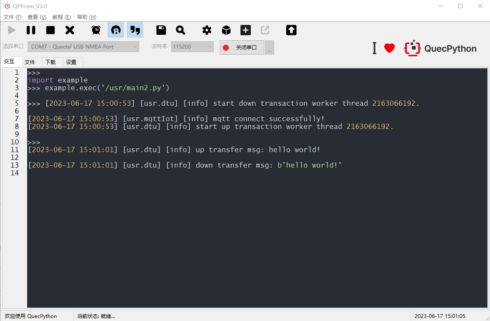

# SimpleDTU上手说明_V1.0

## 一、基本概述

SimpleDTU是一款简单的数据传输单元，支持TCP和MQTT数据纯透传。

本文档旨在指导用户如何基于我司的QuecPython开发板进行SimpleDTU功能开发。

## 三、功能列表

| 功能     | 备注       |
| -------- | ---------- |
| TCP透传  | 单主题透传 |
| MQTT透传 | 单主题透传 |
| 参数配置 | ——         |

## 四、开发指导

### 1、模块型号

本项目可在所有支持QuecPython的模块上进行运行，此文档的实验案例基于EC600N模组（如下图）运行。

> 注意事项：
>
> 1. 在SIM卡座中插入SIM卡。
> 2. 接入天线。
> 3. 使用USB数据线连接开发板至电脑USB接口。
> 4. 连接串口至电脑。

### 2、下载脚本

#### 2.1、获取实验代码

本实验项目代码仓库：`https://github.com/QuecPython/SimpleDTU`。

#### 2.2、编写配置文件

DTU配置文件路径：`code/dtu_config.json`。

本实验案例，基于mqtt私有云做如下配置：

> 参数说明：
>
> `system_config.config`:  指定当前使用的私有云类型。目前支持tcp和mqtt。
>
> `mqtt_private_cloud_config`: MQTT私有云配置。
>
> `socket_private_cloud_config`: tcp私有云配置。
>
> `uart_config`：串口参数配置。

### 3、下载代码到设备

接上数据线，连接至电脑，短按开发板上的**PWRKEY**按键启动设备，并在QPYcom上选择MI05接口连接。

)

### 4、启动DTU服务

运行`main2.py`启动DTU服务。

> 注意：如果将`main2.py`命名为`main.py`，则模组上电后会自动执行该脚本运行服务。

DTU服务中有2个线程处理数据，一个是用于检测读取串口数据并转发数据给云端，一个是检测云端下行数据透传给串口，如下图所示。

### 5、使用QCOM串口调试工具模拟数据透传

打开QCOM，测试流程如下：

1. 在`Input String`输入框中输入`hello world!`字符串
2. 点击`Send Command`按钮通过串口发送数据
3. DTU接收数据上行透传给云端
4. DTU在接收到云端下行数据后，会透传给串口

串口调试工具图示：

QpyCom日志输出：

